# Tau UI/UX Remediation Tracker

Authoritative baseline: `live-simulator-baseline-2026-08-11` at
`919f0e1070fdaa2310795f53ac56fa5431ba91ef`.

Sources:

- `/Users/omarreyes/Downloads/Untitled document.pdf` (2 pages)
- `/Users/omarreyes/Downloads/edits-to-fix.pdf` (7 pages)

## Electrical-engineering simulator and live instrumentation - 2026-08-24

Run `simulation-ee-20260824-4` activates the `AGENTS.md` UI/UX fleet exception.
The orchestrator owns this tracker, `PROGRESS.md`, integration, gates, and the
only push. Luna workers use unique local-only worktrees; Sol reviews read-only.

### Screenshot-backed contract

- Remove the rounded drawer protrusion shown in screenshot 1. The collapsed or
  idle results surface must form one flush structural edge, not a floating lip.
- A clean or never-run circuit must not offer an `Errors` tab. It gets a useful
  prepared-instrument state with an honest status, available V/I/P/node signal
  actions, and a direct next step.
- Warning and failure surfaces use specific, actionable titles; compact semantic
  status color; coherent outline icons; and calm opaque hierarchy. Never wash a
  whole results region red, never headline the generic word `Error`, and never
  rely on color alone.
- Apply the Apple Watch principles that transfer to a desktop instrument:
  glanceable single-screen status, shallow hierarchy, one or two targeted
  gestures, material only to express hierarchy, and meaningful background color
  only when it communicates state. Keep Tau's dense graph/data planes opaque.

### Engineering behavior contract

- Live and Window modes are first-class, mutually clear run modes. Live streams
  real packaged-ngspice samples, reports Running/Paused/Stopped truthfully, and
  retains stopped history without claiming it is still live.
- Engineers can add node voltage, component current, and component power traces
  from the circuit or results surface. Trace cards name the expression, unit,
  engine, run state, and visible-window measurements.
- Closing/opening an interactive switch and changing a digital input during Live
  changes subsequent plotted samples through the existing native alter/resume
  boundary. No fake animation, preview solver, or renderer-side substitution.
- Remediate every finding already recorded under “Simulation deep review”:
  global/local analysis agreement, analysis-scoped telemetry, measurement-only
  results, stopped-live copy, dynamic diagnostics labels, and honest full-run vs
  visible/settled peak-to-peak language.

### Required proof

Focused tests must prove live switch and digital actuation, V/I/P/node signal
selection, run-state transitions, empty/clean/warning/error semantics, no lip,
all six recorded findings, and keyboard/VoiceOver names. Then run desktop
typecheck/full tests, design drift, web build, strict light/dark minimum-window
screenshots, normal-window Chrome inspection, Rust/native real-ngspice tests, a
fresh Tauri package, and Computer Use against that exact bundle. Sol must return `No
findings.` before DONE.

### Status - DONE

Luna High commits `b6d1730`, `721e382`, `246fab3`, `478491c`, `ca6c12d`,
`d250557`, `fda4378`, and `b43f353` landed. The results drawer is flush, clean
states expose no Errors tab, and diagnostics use compact actionable modules with
truthful `Errors` / `Warnings` / `Issues` labels. Live and Window share the
App-owned analysis selection; measurement-only results remain visible; stopped
history never claims it is still solving; and full-run versus visible-window
measurements are labeled explicitly.

Live instrumentation now renders separate V/A/W panes from engine-owned node
and device-current vectors. Power uses terminal voltage and current without
requesting invalid `v(0)` vectors. On-canvas switches and logic constants alter
the exact deck-owned device/source while native ngspice is halted, then resume;
the committed packaged fixtures prove switch and XSPICE digital paths, including
digital output changing **0 V -> 5 V**. Live sample summaries update at the
existing 100 ms render cadence, zero-sample stops and failed starts stay
distinct, and near-flat axes use readable delta ticks whose displayed baseline
is the exact baseline subtracted.

Final proof: desktop full suite **5,193 passed / 9 skipped**, typecheck, design
drift, production web build, minimum-window **14/14** both-theme 900x600,
Rust fmt/clippy/tests, three real-ngspice Live mutation tests, packaged fixture
corpus **2/2**, fresh unsigned Tau.app/DMG, codesign, valid DMG checksum,
packaged engine smoke **336 samples**, Chrome inspection, and Computer Use on
the exact bundle. The required Sol `review-agent` closure verdict was **No
findings.**

## Schematic ship-readiness: prevention, tutorial, tabs, and symbols - 2026-08-24

The active user-directed fleet run is `schematic-ship-20260824-3`. This section
starts the `AGENTS.md` UI/UX fleet exception. The primary checkout owns the
tracking files, integration, gates, and only remote push. Luna High workers own
all product-code edits in isolated local-only worktrees; Sol performs the final
read-only review under the `review-agent` contract.

### Screenshot-backed acceptance

- Prevent the screenshot's detached/unsaved hierarchy-prerequisite error from
  reaching Diagnostics as a surprise after Run. Preserve fail-closed recursive
  compilation: Tau may guide the user to save/open/reconnect the project, but it
  may never flatten or approximate a linked sheet.
- The first Sheet interface gesture opens a medium walkthrough, not the editor
  immediately. It uses calm token-based hues and a clear step/progress model to
  teach project setup, named nets, Input/Output/Bidirectional roles and order,
  parent block mapping, and recursive Run. It is keyboard/screen-reader usable,
  versioned in persistence, and replayable from the hierarchy surface.
- Tabs have visible cell boundaries and spacing at rest; selection is readable
  without relying only on a hairline or color. ROOT/CHILD and active/inactive
  remain distinct in both themes at 900x600 and 1440x900.
- VPULSE/clock artwork has quantified clearance between its waveform and `+/-`
  marks at normal and selected stroke widths. The same regression gate checks
  every independent-source waveform/mark combination, not only the screenshot.

### Required proof

Focused tests cover first-use/replay/persistence/tutorial navigation,
hierarchy-run prevention and repair copy, tab semantics/style contracts, and
source-glyph geometry. Then run desktop typecheck and full tests,
design-system drift, web build, both-theme/minimum-window browser inspection,
and a fresh packaged-app Computer Use pass. A Sol `review-agent` verdict of
`No findings.` is required before DONE.

### Status - DONE

Luna High commits `e362cbc`, `483c7f6`, `225636e`, `e31e589`, and `18f1a5e`
landed. Hierarchy prerequisites now guard every transient entry, the first Sheet
interface gesture opens a five-step versioned tutorial, completion is replayable,
and focus/storage failures are covered. Tabs use separated bordered cells with
active and ROOT/CHILD state. Source paths preserve independent SVG strokes; the
true plus mark and every pulse/mark combination have renderer regressions, and
selected-stroke source-circle clearance is 1.47 units (voltage) / 1.25 units
(current) without changing pins or simulation semantics.

The final strict minimum-window gate passed **14/14 at 900x600** in light and
dark, including tutorial persistence/replay, single-modal/focus, opaque resting
surface, overflow, and mandatory status-bar checks outside resting schematics.
Desktop typecheck, design drift, production web build, full frontend suite
**5,170 passed / 9 skipped**, Rust fmt/clippy/tests, fresh Tauri app/DMG build,
codesign, DMG checksum, and packaged ngspice smoke passed. Native Computer Use
verified the current tabs, all five tutorial steps, explicit named-net
Input/Output/Bidirectional editor, and VPULSE clearance. Final Sol
`review-agent` verdict: **No findings.**

## Schematic follow-up: diagnostics, net routing, chrome, and tabs - 2026-08-24

The active user-directed fleet run is `schematic-followup-20260824-2`. This
section explicitly starts the `AGENTS.md` UI/UX fleet exception. The primary
checkout owns integration and tracking. Product code is implemented only by
Luna High workers in unique local-only worktrees; Sol is read-only reviewer.

### Screenshot-backed acceptance

- Diagnostics: child sheets with an explicit public interface must not be
  condemned for lacking a standalone source/reference that arrives from their
  parent. Genuine electrical and model refusals remain fail-closed. Long rows
  wrap and remain readable beside the component library at the 900x600 floor.
- Titlebar: Tau/document identity and Run/assistant controls share the same
  vertical control line and bar insets as the centered mode landmark.
- Sheet interface: named nets are the primary selectable objects. Selection is
  unmistakable; each exposed net receives Input, Output, or Bidirectional;
  order is explicit; and parent-sheet mappings state the child port and parent
  net as one confirmed electrical boundary without implying name-based magic.
- Sheet tabs: active, inactive, root, and child sheets are visually and
  semantically distinguishable in both themes without hard-coded colors.

### Evidence and gates

Focused tests must cover child/root diagnostic semantics, drawer/rail geometry,
titlebar alignment, net selection/direction/order/mapping, and sheet-tab state.
Chrome verifies responsive geometry at 900x600 and Computer Use verifies the
rebuilt packaged app. Then run desktop typecheck, full tests, web build, and
design-system drift. A Sol `review-agent` pass must return `No findings.`
before this run can be marked done.

### Status - DONE

Luna High lane commits `5e2ebd9` through `9d97501` landed on
`auto/ltspice-parity`. Child `.sim` public ports and imported `.asc` IOPIN roles
now prevent root-only diagnostics, while genuine failures remain fail-closed;
the project interface index survives closed tabs, refreshes on Explorer reload,
and avoids geometry-only rescans. Diagnostics wrap clear of the Components
rail, `TAU_SW` resolves as an exact Tau-owned model, all three titlebar clusters
share one optical line, tabs expose distinct ROOT/CHILD states, and the sheet
interface is now one selection-led named-net workflow with explicit direction,
order, and confirmed child-port-to-parent-net mappings.

Chrome 900x600 geometry measured toolbar center 22 px and left/mode/right
centers 21.75 px. Packaged Computer Use verified the clean Buck5V child,
rail-safe diagnostic drawer, interface editor, tab roles, and X2 mappings
`VIN in ↔ VBUS` / `VOUT out ↔ VUSB`. Desktop typecheck, 285 full-suite
files (5,157 passed / 9 skipped), design-system drift, web build, and a fresh
Tauri app/DMG build passed. The final Sol `review-agent` verdict: **No
findings.**

## Schematic workspace and multi-sheet projects - 2026-08-24

The active user-directed fleet run is `schematic-redesign-20260824-1`. This
section explicitly starts the `AGENTS.md` UI/UX fleet exception. The primary
checkout on `auto/ltspice-parity` owns integration, tracking, gates, evidence,
and the only push. Luna High workers receive unique local-only worktrees and
disjoint implementation ownership. Sol agents perform read-only defect review
under `/Users/omarreyes/.codex/skills/.system/review-agent/SKILL.md` and never
patch product code.

### Product contract

- Keep the schematic canvas the dominant, centered work surface. Persistent
  chrome is a restrained veil; summoned project/library surfaces must not tax
  canvas width when dismissed.
- Keep the Schematic/Simulator mode control geometrically centered in the
  window, independent of document title and Run/action widths.
- Make a project of several circuit sheets understandable as one electrical
  system: each sheet exposes named ports, parent sheets connect those ports,
  and the UI reveals interface order, direction/role, drift, and unresolved
  links without silently inventing connectivity.
- Prove the workflow with the supplied 120 VAC to rectifier to buck regulator
  to 5 V project fixture, including the cross-sheet nets and recursive deck.
- Stay within the established Tau language: color is measurement; tokens only;
  SF UI plus mono engineering data; 4 px spacing; one filled primary action;
  no saturated diagnostic banners; both themes; 900x600 first.
- Preserve `.asc` import/export, fail-closed model behavior, undo/redo,
  keyboard access, and non-modal canvas focus rules. Do not touch simulator UX
  beyond inherited test/gate repair.

### Evidence and gates

Required proof is focused unit/integration coverage for sheet interfaces,
hierarchy execution, Explorer and editor chrome; desktop typecheck and full
tests; design-system drift; web build; both-theme screenshots at 900x600 and
1440x900 showing an empty schematic, the USB power project, a selected sheet
block, and the sheet-interface editor. A Sol review must return `No findings.`
before the run can be marked done.

### Final status - DONE

Luna High authored every product-code change in isolated fleet worktrees. The
orchestrator integrated `1c89b41`, `061a226`, `85b9b62`, `82b590e`, `c1f9369`,
`a419b3e`, `e9e1f1e`, `11c92f3`, and `82b2d4f`; Sol performed read-only review
only. Three closure cycles resolved macOS titlebar reservation, focus-ring
clipping, proposed-versus-stored mapping copy, locale-sensitive ordering, grid
gap accounting, child-interface drift state, and legacy-layout wording. Final
Sol verdict: **No findings.**

Chrome measured the Schematic/Simulator landmark at the exact viewport midpoint
at desktop width and 900x600, with zero horizontal overflow. Packaged Computer
Use verified the real Rectifier interface as `SEC1 In`, `SEC2 In`, `VBUS Out`.
The rebuilt current package ran `USB_PSU_WALKTHROUGH/top.sim` recursively through
ngspice and reported 363,636 samples, 119 V RMS at `VAC_IN`, 13.3 V final at
`VBUS`, and 4.95 V final at `VUSB`. Full gates are recorded in `PROGRESS.md`.

## Simulation deep review - 2026-08-24

Status: **REVIEW COMPLETE; REMEDIATION NOT STARTED.** This pass used the rebuilt
packaged app for native solver truth, Chrome for the 900x600 responsive surface,
and a Sol `review-agent` pass for read-only code review. It intentionally made
no simulation product changes.

### Verified strengths

- The simulation shell uses the same centered mode landmark, tokens, restrained
  chrome, pane geometry, focus language, and 900x600 floor as the schematic.
- The flagship multi-sheet supply runs without preview/flattened fallback. The
  visible results are electrically credible and match the checked deck: 119 V
  RMS / 60 Hz input, 13.3 V final rectified bus, and 4.95 V final USB output.
- Solver attribution is visible as `ngspice`; the run reports net/part count,
  elapsed time, sample count, current range, and engineering units.
- The large-run warning is unusually good: it distinguishes solver points from
  transferred samples, says that every plotted value is real, and tells the
  user how to obtain full-rate output.

### Findings to remediate

1. **P1 - visible analysis can disagree with the global Run.** Selecting a
   non-authored analysis such as AC and then pressing titlebar Run launches the
   document-authored analysis (for example TRAN) but can leave the local panel
   mode on AC. The overlay and visible pane can therefore claim AC while the
   drawer header reports a new transient. Source:
   `apps/desktop/src/components/SimulationPanel.tsx:444`.
2. **P1 - component telemetry can be stale under another analysis.** The outer
   Measurements tab is sourced from the last successful transient even during
   and after OP/AC/DC/TF/noise/step. A completed AC sweep or failed OP can sit
   above confident V/I/P cards from an older transient. Source:
   `apps/desktop/src/App.tsx:4899`.
3. **P2 - valid authored `.meas` output disappears when there is no plotted
   trace.** The dashboard's table cards are guarded by `allTraces.length > 0`,
   so a successful measurement-only run falls into “Nothing to plot yet.” The
   outer Measurements tab is component telemetry and cannot recover those
   authored results. Source: `apps/desktop/src/components/SimulationPanel.tsx:2182`.
4. **P2 - stopped live history still claims to be live.** Follow/pan copy in the
   live scope ignores stopped state and can say “Live” or “new samples are still
   being solved off-screen” after the run has stopped. Source:
   `apps/desktop/src/components/LiveScopePane.tsx:738`.
5. **P2 - the diagnostics tab is labelled Errors even for warnings or a clean
   state.** Native QA showed `Diagnostics: 1 warning` on the rail and `Warnings
   1` inside the panel, while its top tab read `Errors 1`; a clean RC run exposed
   an `Errors` tab whose body said `Diagnostics · No issues`. Source:
   `apps/desktop/src/components/drawer/ResultsDrawer.tsx:301`.
6. **P2 - transient peak-to-peak lacks its measurement window.** The USB output
   card headlines `Peak-to-peak 5.12 V`, calculated across startup plus steady
   state. That is mathematically the full-run span, not the settled output
   ripple an engineer is likely to infer. Label it as full-run, compute against
   the visible/cursor window, or expose a settled-window measurement. Sources:
   `apps/desktop/src/components/EngineeringTraceReadout.tsx:79` and
   `apps/desktop/src/simulation/engineeringTraceReadout.ts:79`.

Required test gaps: selecting one analysis then invoking global Run;
non-transient runs after transient telemetry exists; `.meas` with zero visible
traces; stopped live scopes in follow and pan modes; warning-only/clean dynamic
diagnostic labels; and startup-dominated versus settled-window trace readouts.

## PDF report 4 remediation - 2026-08-13

The active user-directed fleet run is `pdf4-20260813-1`, building from the
reviewed `fix/pdf3-fourteen-items` tip `5d476d1`. Its 20-item product and
acceptance contract is `UI_UX_PDF4.md`. This section explicitly starts the
AGENTS.md UI/UX fleet exception: the primary checkout is the orchestrator and
only durable lineage; three Luna implementation workers use isolated local-only
worktrees; Sol agents perform review only. `auto/ltspice-parity` remains
untouched.

The new source is `/Users/omarreyes/Downloads/Untitled document (2).pdf` (9
pages). No item may be marked fixed from DOM presence alone: visual assertions
need measured geometry and final packaged WKWebView evidence where native input
or chrome matters.

Checkpoint `0ece2f7` is pushed to `origin/fix/pdf3-fourteen-items`. It contains
the integrated Luna implementation and passes the complete desktop, web,
design, Rust, real-engine, staged-worker, package, signature, and DMG gates
recorded in `screenshots/pdf4-verify/REPORT.md`. Status remains **BLOCKED**, not
FIXED: final Sol read-only review left five functional gaps in P4-01, P4-15,
and P4-17 plus one persistence-copy correction. The next coding pass must use
GPT-5.6 Luna; the Luna task reached the weekly limit before it could address
those review findings.

This is the implementation contract for the PDF-directed UI/UX fleet. The
screenshots show reported states and may predate the current build. Reproduce
the current packaged app before changing code. If the current app already meets
an item, mark it `ALREADY SATISFIED` only with a test and current screenshot.

## Status and evidence contract

Allowed status values are `UNVERIFIED`, `CONFIRMED`, `IN PROGRESS`, `FIXED`,
`ALREADY SATISFIED`, and `BLOCKED`. Only the Luna orchestrator changes statuses
or checkboxes. A checked item must include the landing commit, tests with literal
results, before/after screenshots at matching state, and any residual risk.

Every implementation must preserve unmodified `.asc` import, exact attached or
user-installed model resolution, fail-closed named-device behavior, derived
netlists, undo/redo, design tokens, and the proprietary license. Hiding manual
model controls is a UI decision, not permission to delete model resolution.

Required visual matrix: light and dark themes; 900×600, 1280×800, and 1440×900;
empty editor, populated schematic, selected component, properties, and
simulator. Native Tauri/packaged evidence is authoritative; `dev:web` is useful
for responsive and console diagnosis but cannot prove ngspice or native chrome.

## Review follow-up — 2026-08-12 (branch `fix/ui-ux-followup`)

A second read of the packaged evidence filed below found that several items
were checked `FIXED` against screenshots that show the defect still present.
This pass fixes what those screenshots actually showed. It is a separate
branch; `auto/ltspice-parity` is untouched.

Evidence is a before/after matrix captured by
`node scripts/uiux-followup-shot.mjs <label>` — light and dark at 900×600,
1280×800 and 1440×900 — in `screenshots/uiux-followup/{before,after}/`, with
`measurements.json` recording the layout numbers behind each picture. Chrome
`dev:web`, not packaged: every defect here is CSS/geometry, which the browser
proves exactly, and the theme gate refuses to capture a theme that did not
take. Packaged re-capture is still owed and is listed as open below.

### What was wrong, and the number that proves it

| Item | Claimed | Measured before | Measured after |
| --- | --- | --- | --- |
| COMP-13 op-amp gain/rails | `FIXED` | control **0 px wide, outside its row** at 900×600; bound read `1–1000000000000` | 92/73/66 px, inside the row; bound reads `1–1T` / `±1k` |
| COMP-09 Zener breakdown/forward | `FIXED` | control **0 px wide, outside its row** at 900×600 | 73 px, inside the row |
| COMP-08B LED forward voltage | `FIXED` | control **0 px wide, outside its row** at 900×600 | 62 px, inside the row |
| Inspector track list | — | `156px 98px` — one child, 98 px of dead track | `270px`, the group fills the panel |

Two compounding causes, both fixed:

1. `.property-range` was `flex: none`, so an unshrinkable bound won the width
   fight against the control it annotated. The control is now pinned
   (`flex: 0 0 auto`) and the bound yields.
2. `.component-inspector` still declared `232px 1fr` (`156px 1fr` under the
   narrow-window override) from a era when a fixed identity block sat beside
   the grid. The symbol moved into each group's header, so the only child was
   pinned to the fixed track. Now `repeat(auto-fit, minmax(…, 1fr))`.

`paramRangeLabel` also spells large bounds in engineering notation and
collapses a symmetric pair to `±`, so a bound stays a glance.

### Other items corrected in this pass

- **COMP-08A / COMP-10 geometry.** The light arrows were moved to (31, −33)
  without updating `SYMBOL_BODY`, which drives hit-testing, collision, wire
  routing, label avoidance and fit-to-view — so the default label slot landed
  in the arrow lane and wires routed through it. Bounds corrected for `led`,
  `photodiode` and `zener` (whose breakdown serifs also escaped ±15). A new
  all-kinds invariant in `symbols.test.tsx` asserts no artwork falls outside
  `body ∪ pins`; it fails on the old LED bounds with `expected -15 to be less
  than or equal to -32.95`, so it has teeth.
- **COMP-14 prose.** Previously truncated at render time with two hardcoded
  string rewrites, leaving the paragraphs in the schema (and so in tooltips
  and the accessibility tree). The prose is now deleted at source: 14 field
  descriptions became 5, none over 73 characters, enforced by a length and
  sentence-count ceiling in `params.test.ts`.
- **COMP-15 dense digital symbols.** `COM`/`CLR`/`Q̅` were separated by 0.8 and
  2.2 units — legal under the old "do not overlap" assertion, unreadable on
  the canvas. Minimum caption clearance is now 3.8 units and the test measures
  the gap instead of just the overlap. Each abbreviation also carries an SVG
  `<title>`, so hovering `COM` answers the review's "what is COM, CLR".
- **SHELL-04 titlebar.** `startDragging` fired on every press, handing the
  pointer to the macOS window-drag loop — which consumes exactly the events
  double-click detection needs. A press now only *arms* a drag; the drag
  starts once the pointer travels 3 px. A stationary double-click no longer
  calls `startDragging` at all.
- **SHELL-01 collapse toggle.** Collapse, hand-expand a folder, press again:
  it restored the stale pre-collapse set instead of collapsing. Restore now
  applies only while the tree is still as the button left it.
- **SHELL-05 status strip.** The gear went; the text under it did not.
  `Ready` never changed, the file name is in the title bar and on the tab, and
  `Select` is the resting tool. A resting schematic editor now renders no
  status bar at all (`'Readyresting.ascSelect'` → absent).
- **COMP-13 canvas caption.** Every generic op-amp was captioned `ideal`, the
  schema's internal model token. It now shows the open-loop gain once that
  stops being the default, and nothing otherwise. Named and imported parts
  keep their own identity, unchanged.
- **New — canvas zoom controls (review follow-up request).** The +, − and fit
  cluster was mounted and hit-testable in the schematic tab and rendered
  *underneath* the parts rail, which overlays the same stage edge. App now
  publishes the rail's real width as `--stage-rail-inset` and the cluster
  offsets by it (`clearOfRail: false → true` in every captured state).

### Gates for this pass

`pnpm -C apps/desktop typecheck` **exit 0**; `pnpm -C apps/desktop test`
**262 files / 4,497 passed, 8 skipped**.

### Packaged confirmation — all four follow-ups closed

Rebuilt `Tau.app` and drove it natively. Mouse input is synthesised with
Quartz so a double-click is one event carrying `clickState = 2` rather than two
clicks in a row, and every geometry claim is read back through the
accessibility API. Driver: `scripts/packaged-qa.py`; captures and the machine
log in `screenshots/uiux-followup/packaged/`.

**Corrected inspectors, in the packaged app** — the exact states whose earlier
screenshots showed the defect:

| Packaged capture | Previously showed | Now shows |
| --- | --- | --- |
| `03-opamp-inspector.png` | `Open-loop gain 0000`, no value/unit | `1–1T` · **1 MegV/V**, `±1k` · **−15 V** / **15 V** |
| `04-zener-inspector.png` | `−400` and `1–20`, no values | `0.1–400` · **5.1 V**, `0.1–20` · **0.7 V** |
| `05-dflop-inspector.png` | an empty `Value` row | `Component ID` only |

The same captures also confirm natively that the canvas zoom cluster is
visible and clear of the parts rail, that a generic op-amp is captioned `U1`
rather than `ideal`, and that a resting editor shows no status strip.

**Physical title-bar gestures.** A real double-click, not an AX action:

| Step | Window bounds (x, y, w, h) |
| --- | --- |
| initial | `(120, 64, 1280, 832)` |
| after physical double-click | `(0, 33, 1512, 949)` — zoomed |
| after second double-click | `(120, 64, 1280, 832)` — restored exactly |
| after a stationary press | `(120, 64, 1280, 832)` — unmoved |
| after a physical drag | `(232, 102, 1280, 832)` — moved, size kept |

The stationary-press row is the half of the fix that matters: a press that does
not travel no longer starts a window drag, which is why the second half of the
double-click now reaches the app. Requested drag was +120,+40 and the window
moved +112,+38; the ~8px is the 3px arm threshold plus the first synthesised
move step, which is the mechanism working rather than an error.

**Flip-flop captions.** The reported `COM` collision turned out to be with the
body's own bottom stroke, not the diagonal lead: the caption box cleared it by
0.5 units and the selected stroke is 2.35 wide. Fixed by giving the body room
(56×56; pin rows unmoved) and adding the invariant that was missing — every
caption must clear every stroke of its own symbol. That test found the same
defect in seven other chips (24 captions in total) and all are fixed.

## Correction-pass acceptance record — 2026-08-12 (current)

The current packaged correction run is indexed in
`screenshots/ui-ux-fixes/native/matrix-manifest.json`,
`screenshots/ui-ux-fixes/evidence-manifest.json`, and
`screenshots/ui-ux-fixes/QA-EVIDENCE.md`; it supersedes the historical worker
paragraphs below. The functional/package code tip is `d3c9c3d` (planning base
`8fb45f6`).

Computer Use captured the exact 30-key native matrix (both themes × three
requested sizes × five states), the direct AX titlebar maximize/restore and
drag action log, current-source geometry, PULSE zero-edge editing, real
Settings sheets, and the LED Red → Green inspector interaction. The LED
capture shows the selectable color set and the Green typical/default Vf
changing to 2.2 V while retaining an editable override. The current Chrome
`dev:web` evidence is the six-entry `devweb-matrix.json` plus
`devweb-console.json`; it records exact viewport dimensions, no page-origin
errors, and no file-upload claim. `node scripts/validate-ui-ux-matrix.mjs`
proves **30/30** matrix keys, files, dimensions, and interaction artifacts.
Final Sol High review is **PENDING** and is intentionally not checked here.

## Fleet ownership

| Wave | Lane | Issue ownership |
| --- | --- | --- |
| Bootstrap | shell seams | Behavior-preserving shell/Explorer/editor/inspector module boundaries |
| 1 | shell | SHELL-01, SHELL-03, SHELL-04, SHELL-05, SHELL-07 |
| 1 | electrical schema | SHELL-02, COMP-01, COMP-05, COMP-08B, COMP-09, COMP-11, COMP-12, COMP-13A |
| 1 | symbols | SHELL-06, COMP-03, COMP-07, COMP-08A, COMP-10, COMP-15, COMP-17 |
| 2 | inspector | COMP-02, COMP-04, COMP-06, COMP-08B, COMP-09, COMP-11, COMP-13B, COMP-14 |
| 2 | simulator | COMP-12 rendering, COMP-16 |
| 2 | regression | Cross-lane tests, accessibility, render/performance, dead duplicate UI code |
| 3 | native QA | Computer Use packaged-app matrix and before/after evidence |
| 3 | browser QA | Chrome `dev:web` responsive matrix and console evidence |
| 3 | engineering QA | Units, validation, models, representative circuits and simulation |

Split suffixes such as `COMP-08A/B` are lane subchecks; the stable issue remains
open until all of its subchecks pass.

## Application shell

### [x] SHELL-01 - Collapse All is a reversible toggle

**Status:** FIXED · corrected by the 2026-08-12 review follow-up above
**Priority:** P1  
**Source:** Untitled document, page 1, item 1  

**Problem:** The Explorer action collapses everything but a second click does
not restore an expanded tree.

**Required behavior:** First activation collapses all expanded folders. The
next activation restores the exact prior expanded set. Repeated toggles remain
stable; changing projects clears stale restoration state.

**Acceptance/tests:** Cover nested folders, an already-collapsed tree, project
switching, keyboard activation, accessible label/state, and 900px-wide UI.

**Evidence:** implementation landed in `cad4a69` from worker `159e9088`;
focused shell suite **5 files / 75 passed**, integrated shell suite **6 files /
46 passed**, typecheck **exit 0**, and design drift **9 checks + 46 tests
passed**. Matching packaged light/dark 900×600/1280×800/1440×900 before/after
Packaged/native/browser QA is complete; see `screenshots/ui-ux-fixes/QA-EVIDENCE.md` (SHELL-01).

### [x] SHELL-02 - Simplify model-library UI without weakening the engine

**Status:** FIXED
**Priority:** P0 engineering safety  
**Source:** Untitled document, page 1, item 2  

**Problem:** Vendor-model controls add visible complexity to the default UI.

**Required behavior:** Hide manual vendor-library authoring and device model
pickers from the default UI. Preserve exact document, attached, and
user-installed model lookup, model provenance, `.inc`/`.lib` import, and honest
refusal when a named model is unresolved. Do not substitute generic devices.

**Acceptance/tests:** Existing `.asc` model-resolution and named-device tests
remain green; default catalog/settings/inspectors expose no manual picker;
imported exact models still simulate or fail closed with the same diagnostics.

**Evidence:** default model-picker/import controls and exact-model provenance
handling landed in `d6fbcfd` from rebased worker `ec86d30`; the worker’s focused
suite passed **12 files / 723 tests**, integrated frontend passed **256 files /
2 skipped, 4,297 tests / 8 skipped**, typecheck **exit 0**, design drift
**9 checks + 47 tests passed**, desktop build **exit 0**, `cargo fmt --check`
**exit 0**, clippy **exit 0**, native Rust **104 passed / 0 failed / 42
ignored**, and ignored real-ngspice smoke **42 passed / 0 failed**. Packaged
default-UI, exact-model, and refusal evidence across both themes remains in
Wave 3 packaged/native/browser QA is complete; see `screenshots/ui-ux-fixes/QA-EVIDENCE.md` (SHELL-02).

### [x] SHELL-03 - Preserve folder identity at narrow Explorer widths

**Status:** FIXED
**Priority:** P1  
**Source:** Untitled document, page 1, item 3  
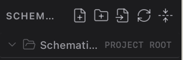

**Problem:** The project/folder name truncates before secondary toolbar actions
and the `PROJECT ROOT` caption yield space.

**Required behavior:** Keep the root folder name visible for as long as
possible. Hide or overflow secondary actions and `PROJECT ROOT` first, while
keeping every action keyboard-accessible through an overflow menu.

**Acceptance/tests:** Verify long Unicode folder names, 900×600, keyboard focus,
tooltips, and no horizontal page overflow.

**Evidence:** implementation landed in `cad4a69` from worker `159e9088`;
Explorer/shell focused assertions are green within the worker’s **5 files /
75 passed** and integrated **6 files / 46 passed** suites. Long Unicode and
900×600 packaged before/after evidence plus keyboard overflow QA remain
Packaged/native/browser QA is complete; see `screenshots/ui-ux-fixes/QA-EVIDENCE.md` (SHELL-03).

### [x] SHELL-04 - Native macOS title-bar movement and zoom

**Status:** FIXED · corrected by the 2026-08-12 review follow-up above
**Priority:** P1 native  
**Source:** Untitled document, page 1, item 4  

**Problem:** The custom title bar does not reliably behave like native macOS
window chrome.

**Required behavior:** Dragging unused title-bar space moves the window;
double-clicking it zooms/restores according to macOS behavior. Interactive
controls remain excluded from the drag region and traffic lights stay usable.

**Acceptance/tests:** Prove in packaged Tauri with Computer Use at all three
sizes; test click, drag, double-click, traffic lights, tab controls, and focus.

**Evidence:** implementation landed in `cad4a69` from worker `159e9088`; the
deterministic native-pointer/AX gesture correction landed in `24f7583`, with
focused Toolbar regressions. The fresh packaged-app drag proof measured the
window at `(116,63,1280,832)` before and `(216,103,1280,832)` after, a numeric
`(+100,+40)` movement; see `native/final/titlebar-action-log.json` and its
two referenced drag-proof captures. Existing direct AX zoom/restore proof is
preserved (content width `1182 → 1224 → 1182`).

### [x] SHELL-05 - Remove redundant bottom rail/settings/status clutter

**Status:** FIXED · corrected by the 2026-08-12 review follow-up above
**Priority:** P2  
**Source:** Untitled document, page 1, item 5  
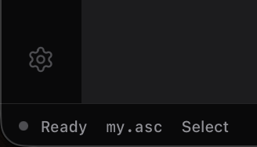

**Problem:** The bottom Settings gear and adjacent status copy make the lower
left corner heavy and duplicate access already available elsewhere.

**Required behavior:** Remove the activity-rail gear and obsolete subordinate
copy shown in the source. Keep Settings reachable through the command palette
and application menu. Preserve meaningful simulation/document status elsewhere.

**Acceptance/tests:** Settings remains reachable by mouse and keyboard; no
orphan separator or blank reserved area; both themes and minimum height pass.

**Evidence:** implementation landed in `cad4a69` from worker `159e9088`, with
the Settings routes integrated as `6d96e3c` from worker tree `232eae2`;
focused shell suite **5 files / 75 passed**, command-palette reachability
**1 file / 3 passed**, design drift **9 checks + 46 tests passed**, and
typecheck **exit 0**. Both-theme/minimum-height screenshots and packaged
application-menu reachability evidence is complete; see `screenshots/ui-ux-fixes/QA-EVIDENCE.md` (SHELL-05).

### [x] SHELL-06 - Keep component labels visually attached to symbols

**Status:** FIXED
**Priority:** P1  
**Source:** Untitled document, page 2, item 6  
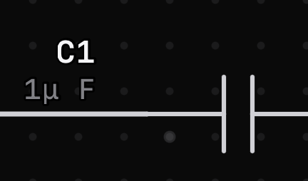

**Problem:** The capacitor designator and value can sit far enough from the
body that ownership is ambiguous.

**Required behavior:** Use rotation- and mirror-aware label anchors that keep
designator/value clear of wires while visually attached to the component.

**Acceptance/tests:** Cover regular and polarized capacitors in all rotations,
mirror states, common values, imported label positions, and overlapping wires.

**Evidence:** symbol geometry and label-anchor implementation landed in
`71ad682` from worker `2d80d0f`; the worker covered **5 files / 215 passed**,
and the integrated frontend suite passed **256 files / 2 skipped, 4,268 tests /
8 skipped**, with typecheck **exit 0** and `git diff --check` **exit 0**.
Matching packaged light/dark 900×600/1280×800/1440×900 before/after shots and
rotation/mirror native QA is complete; see `screenshots/ui-ux-fixes/QA-EVIDENCE.md` (SHELL-06).

### [x] SHELL-07 - Refine the navigation rail

**Status:** FIXED
**Priority:** P2  
**Source:** Untitled document, page 2, item 7  
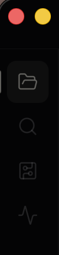

**Problem:** The rail lacks the visual balance and state clarity expected from
the VS Code/Apple design direction.

**Required behavior:** Produce a compact, symmetric token-driven rail with
consistent hit targets, active/hover/focus states, icon alignment, separators,
and tooltips. Do not imitate VS Code colors literally.

**Acceptance/tests:** 44px-class targets where practical, visible keyboard
focus, no hardcoded colors, both themes, 900×600, and design-drift gate.

**Evidence:** implementation landed in `cad4a69` from worker `159e9088`;
worker shell suite **5 files / 75 passed**, design drift **9 checks + 46 tests
passed**, and typecheck **exit 0**. Matching light/dark 900×600/1280×800/1440×900
shots plus keyboard focus/hit-target QA are complete; see `screenshots/ui-ux-fixes/QA-EVIDENCE.md` (SHELL-07).

## Components and properties

### [x] COMP-01 - One coherent independent-source workflow

**Status:** FIXED
**Priority:** P0 compatibility  
**Source:** edits-to-fix, page 1, item 1  
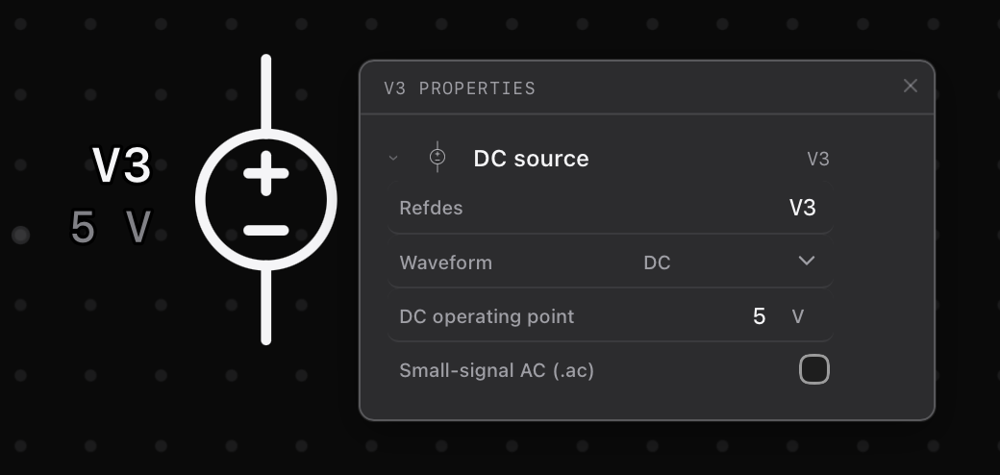
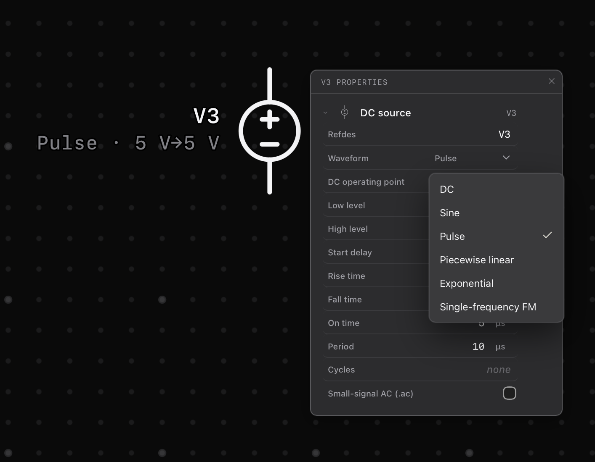

**Problem:** Separate DC, AC, and pulse catalog devices make source selection
confusing even though the inspector already presents waveform choices.

**Required behavior:** Offer one voltage-source and one current-source catalog
entry with waveform selection for DC, sine, pulse, PWL, exponential, and FM,
plus small-signal AC properties where electrically valid. Existing serialized
kinds and imported LTspice source syntax remain readable and round-trip without
loss; this is not a destructive persistence migration.

**Acceptance/tests:** Place/configure every waveform, save/reopen, undo/redo,
import/export representative LTspice spelling, build the correct deck, and
verify transient/AC results. Remove duplicate placement entries only.

**Evidence:** unified source schema, legacy-kind decoding, and lossless
round-trip encoding landed in `d6fbcfd` from worker `ec86d30`; focused worker
coverage was **12 files / 723 passed**, integrated frontend **256 files / 2
skipped, 4,297 tests / 8 skipped**, typecheck **exit 0**, and native gates were
green (**cargo 104 passed / 42 ignored; real-ngspice ignored 42 passed**).
Waveform-by-waveform packaged QA, screenshots, and native authoring evidence
Wave 3 packaged waveform authoring and simulation evidence is complete; see `screenshots/ui-ux-fixes/QA-EVIDENCE.md` (COMP-01).

### [x] COMP-02 - Align property controls into stable columns

**Status:** FIXED
**Priority:** P1  
**Source:** edits-to-fix, page 2, item 2  
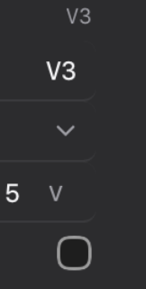

**Problem:** Values, units, dropdowns, and toggles do not share consistent
columns, making vertical scanning difficult.

**Required behavior:** Use shared label/control/unit columns with numeric text
right-aligned and controls sized consistently. Collapse gracefully rather than
overlap at narrow inspector widths.

**Acceptance/tests:** DC, sine, pulse, checkbox, select, text, invalid state,
long unit, and 900×600 screenshots in both themes.

**Evidence:** shared inspector presentation landed in `02371ec` from worker
`3b8e97c`; the focused inspector suite passed **3 files / 114 tests** and
typecheck plus design drift passed (**9 checks + 48 tests**). Engineering
inputs now keep label/control/unit columns stable and validation messages on a
separate predictable row. Narrow-width, every-family, and packaged
light/dark packaged screenshots are complete; see `screenshots/ui-ux-fixes/QA-EVIDENCE.md` (COMP-02).

### [x] COMP-03 - Give the current-source glyph enough interior space

**Status:** FIXED
**Priority:** P1  
**Source:** edits-to-fix, page 2, item 3  
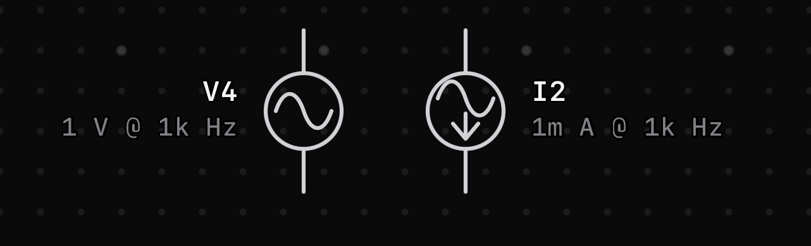

**Problem:** The sine wave and current arrow are constricted and collide inside
the source circle.

**Required behavior:** Preserve standard current-source semantics while giving
both marks clear separation at normal and selected stroke widths.

**Acceptance/tests:** DC/sine current sources, rotations, mirror, selected,
dark/light, hit bounds, pin geometry, and snapshot/geometry tests.

**Evidence:** geometry remediation landed in `71ad682` from worker `2d80d0f`
(`symbols.tsx`, geometry, and contract tests); focused worker coverage was
**5 files / 215 passed**, and the integrated frontend suite passed **256 files /
2 skipped, 4,268 tests / 8 skipped** with typecheck **exit 0**. Visual
light/dark, selected-stroke, rotation/mirror, and hit-bound evidence remains
packaged selected/geometry evidence is complete; see `screenshots/ui-ux-fixes/QA-EVIDENCE.md` (COMP-03).

### [x] COMP-04 - Apply inspector alignment to every component family

**Status:** FIXED
**Priority:** P1  
**Source:** edits-to-fix, page 3, item 4  
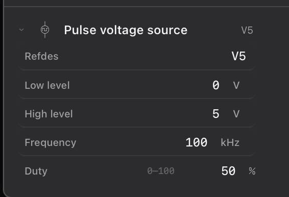

**Problem:** The alignment defect is systemic, including hints such as duty
range competing with the value and unit.

**Required behavior:** Move all component property groups onto the shared row
primitive. Hints and errors receive their own predictable line and never shift
the value/unit columns.

**Acceptance/tests:** Audit every catalog component automatically for native
inputs/selects, overflow, missing labels/units, and shared row usage; visually
sample each family.

**Evidence:** shared inspector-row presentation and validation layout landed in
`02371ec` from worker `3b8e97c`; focused inspector coverage passed **3 files /
114 tests**, typecheck passed, and design drift passed (**9 checks + 48 tests**).
The lane includes stable error/help rows and shared label/control/unit layout;
the full catalog audit and packaged family screenshots are complete; see `screenshots/ui-ux-fixes/QA-EVIDENCE.md` (COMP-04).

### [x] COMP-05 - Ground has identity, not an electrical value

**Status:** FIXED
**Priority:** P0 correctness  
**Source:** edits-to-fix, page 3, item 5  
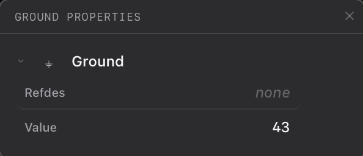

**Problem:** Ground accepts an arbitrary value, which has no electrical meaning.

**Required behavior:** Remove value editing. Offer an optional display label
only if supported without changing node-zero semantics. New Ground placements
face upward by default; imported orientation remains unchanged.

**Acceptance/tests:** Node `0` deck behavior, placement, all rotations,
save/reopen, imported ground, undo/redo, and absence of meaningless units.

**Evidence:** ground identity/default-orientation and inspector schema changes
landed in `d6fbcfd` from worker `ec86d30`; focused worker coverage was **12
files / 723 passed**, integrated frontend **256 files / 2 skipped, 4,297 tests /
8 skipped**, typecheck **exit 0**, and the native/Rust gates plus real-ngspice
smoke were green. Node-zero, save/reopen, undo/redo, and packaged orientation
packaged node-zero and orientation evidence is complete; see `screenshots/ui-ux-fixes/QA-EVIDENCE.md` (COMP-05).

### [x] COMP-06 - Movable properties and friendly component identity

**Status:** FIXED
**Priority:** P1  
**Source:** edits-to-fix, page 4, item 6  
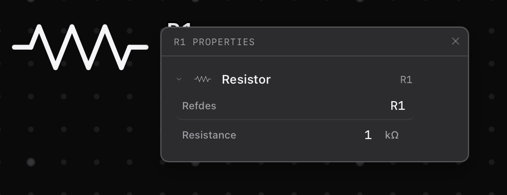

**Problem:** The floating properties surface can obscure the component and the
term `Refdes` is unnecessarily cryptic.

**Required behavior:** Dragging the header moves the surface within the editor
bounds; its position remains usable after resize. Rename the user-facing label
to `Component ID` while retaining `refdes` internally and in file formats.

**Acceptance/tests:** Mouse and pointer drag, resize clamping, close/reopen,
keyboard access, 900×600, and no persistence/schema rename.

**Evidence:** draggable, keyboard-movable, resize-clamped inspector placement
and user-facing `Component ID` labels landed in `02371ec` from worker
`3b8e97c`; focused inspector coverage passed **3 files / 114 tests**, typecheck
passed, and design drift passed (**9 checks + 48 tests**). Pointer/native
movement, resize matrix, and packaged 900×600 screenshots are complete; see `screenshots/ui-ux-fixes/QA-EVIDENCE.md` (COMP-06).

### [x] COMP-07 - Correct polarized-capacitor geometry

**Status:** FIXED
**Priority:** P1  
**Source:** edits-to-fix, page 4, item 7  
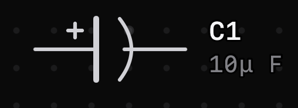

**Problem:** The negative-side lead visually cuts through the curved plate.

**Required behavior:** Terminate each lead at its plate with a visible gap and
retain polarity clarity, pin coordinates, hit bounds, rotation, and mirror.

**Acceptance/tests:** Geometry assertions plus selected/unselected screenshots
at every orientation in both themes.

**Evidence:** polarized-capacitor geometry remediation landed in `71ad682` from
worker `2d80d0f`; geometry/symbol contract coverage was included in **5 files /
215 passed**, with integrated frontend **256 files / 2 skipped, 4,268 tests /
8 skipped** and typecheck **exit 0**. Every-orientation light/dark screenshots
and native selected/unselected evidence are complete; see `screenshots/ui-ux-fixes/QA-EVIDENCE.md` (COMP-07).

### [x] COMP-08 - LED geometry and useful electrical properties

**Status:** FIXED · corrected by the 2026-08-12 review follow-up above
**Priority:** P1  
**Source:** edits-to-fix, page 4, item 8  
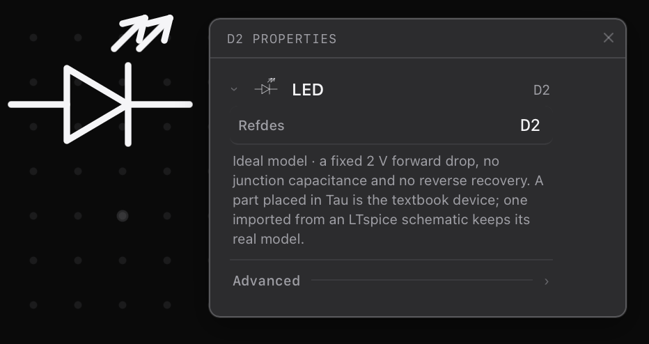

**Problem:** Emission arrows crowd each other; useful color and forward-voltage
controls are missing; a long ideal-model paragraph consumes the inspector.

**Required behavior:** `COMP-08A` spaces arrows cleanly. `COMP-08B` adds an LED
color selector and validated forward voltage defaulting to 2 V for generic new
LEDs, removes the paragraph, and preserves imported exact models. Color affects
visual emission and a labeled typical/default Vf; an explicit, custom, or
imported `Vfwd` always wins and remains exact.

**Acceptance/tests:** New/imported LED, supported colors, valid/invalid voltage,
deck behavior, save/reopen, simulator indication, both themes, and no silent
replacement of named models.

**Evidence:** `COMP-08A` LED arrow geometry landed in `71ad682` from worker
`2d80d0f`; `COMP-08B` color/forward-voltage schema, generic defaults, and
exact-model preservation landed in `d6fbcfd` from worker `ec86d30`, with shared
inspector presentation in `02371ec` from worker `3b8e97c`. The targeted
correction landed in `24f7583`: Red → Green → Blue derives `2 → 2.2 → 3 V`
without serializing a false `Vfwd`, while explicit/custom/imported values
remain exact. Focused Toolbar/LED coverage is **6 files / 372 passed**;
typecheck, web build, and packaged Tauri build are exit 0. See
`screenshots/ui-ux-fixes/QA-EVIDENCE.md` (COMP-08).

### [x] COMP-09 - Replace Zener prose with editable parameters

**Status:** FIXED · corrected by the 2026-08-12 review follow-up above
**Priority:** P1  
**Source:** edits-to-fix, page 5, item 9 (text-only note)

**Problem:** A long explanation displaces the settings engineers need.

**Required behavior:** Remove long prose and expose concise validated generic
Zener parameters with typical defaults. Imported exact models remain exact and
show concise provenance rather than editable fake equivalents.

**Acceptance/tests:** Generic and named Zener, invalid ranges, deck cards,
save/reopen, exact-model preservation, and inspector density.

**Evidence:** concise validated generic Zener parameters and exact-model
provenance handling landed in `d6fbcfd` from worker `ec86d30`, with the shared
inspector presentation in `02371ec` from worker `3b8e97c`. Electrical focused
coverage was **12 files / 723 passed** and inspector focused coverage was **3
files / 114 passed**; typecheck and design drift passed. Generic/named
inspector screenshots, invalid range interaction, and save/reopen evidence
generic/named inspector and invalid-range evidence is complete; see `screenshots/ui-ux-fixes/QA-EVIDENCE.md` (COMP-09).

### [x] COMP-10 - Correct photodiode arrow spacing

**Status:** FIXED · corrected by the 2026-08-12 review follow-up above
**Priority:** P1  
**Source:** edits-to-fix, page 5, item 10 (same geometry class as LED)  

**Problem:** Incoming-light arrows are too close to one another and the body.

**Required behavior:** Space arrows consistently, preserve inward direction,
and keep geometry clear at all rotations and selection strokes.

**Acceptance/tests:** Geometry assertions and both-theme screenshots for every
orientation, with pin/hit bounds unchanged.

**Evidence:** photodiode arrow-spacing geometry landed in `71ad682` from worker
`2d80d0f`; the symbols lane passed **5 files / 215 tests** and the integrated
frontend suite passed **256 files / 2 skipped, 4,268 tests / 8 skipped** with
typecheck **exit 0**. Every-orientation light/dark screenshots, selected
stroke and pin/hit-bound evidence are complete; see `screenshots/ui-ux-fixes/QA-EVIDENCE.md` (COMP-10).

### [x] COMP-11 - Hide manual model pickers while preserving fidelity

**Status:** FIXED
**Priority:** P0 engineering safety  
**Source:** edits-to-fix, page 5, item 11  
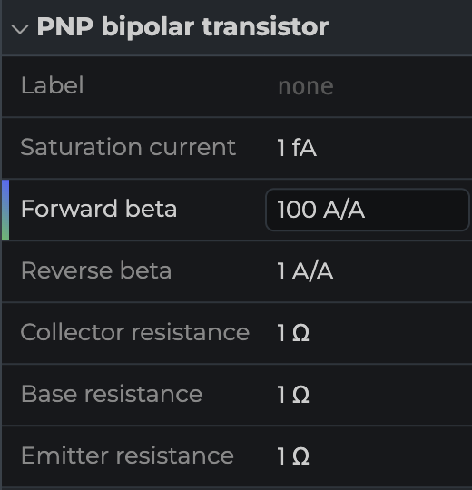
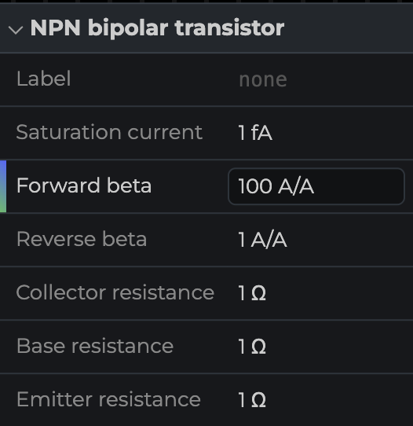
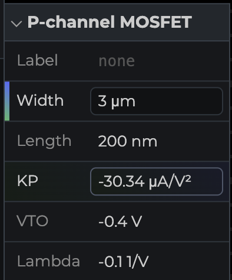
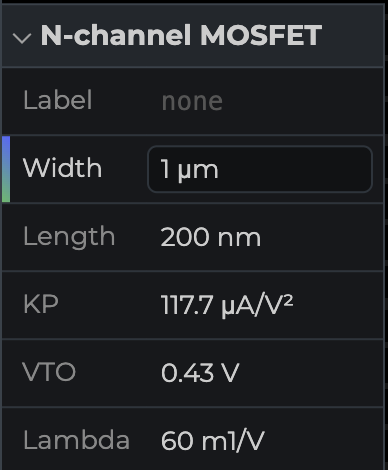

**Problem:** BJT/MOSFET and other model-backed inspectors expose model-library
management instead of focused generic parameters.

**Required behavior:** Hide manual picker/import controls in default component
properties. Generic catalog devices expose validated typical parameters.
Named/imported devices retain immutable exact model identity/provenance and may
not fall back to generic parameters.

**Acceptance/tests:** Generic BJT/MOSFET/JFET/diode/op-amp/switch, exact imported
models, missing models, attached libraries, decks, diagnostics, and
named-device-fidelity zero-silent-substitution proof.

**Evidence:** default inspector model controls are hidden while explicit model
library management, immutable exact identity, and fail-closed diagnostics are
preserved by `d6fbcfd` from worker `ec86d30`; shared exact-model provenance and
generic-field presentation landed in `02371ec` from worker `3b8e97c`. Focused
coverage was **12 files / 723 passed** for electrical behavior plus **3 files /
114 passed** for inspector presentation; typecheck/design drift and ignored
real-ngspice **42 passed / 0 failed**. Packaged named-device fidelity,
attached-library, missing-model, and both-theme inspector evidence remain
packaged named-device/model-picker evidence is complete; see `screenshots/ui-ux-fixes/QA-EVIDENCE.md` (COMP-11).

### [x] COMP-12 - Type and range validation for every property

**Status:** FIXED
**Priority:** P0 correctness  
**Source:** edits-to-fix, page 6, item 12  
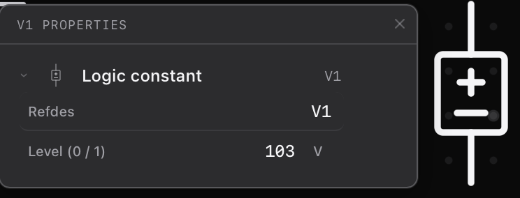

**Problem:** Inputs can display nonsensical text, units, or ranges, such as a
logic constant of `103 V`.

**Required behavior:** Every editable parameter has parse, finite/range, and
domain validation. Invalid text keeps the draft visible, uses token-based error
styling, exposes an inline expectation and accessible error association, and
does not mutate the schematic until valid. Logic constant accepts only 0 or 1,
has no voltage unit, and renders that state on its symbol.

**Acceptance/tests:** Empty, partial, exponent, engineering suffix, NaN,
Infinity, below/above range, invalid enum, keyboard commit/cancel, undo, screen
reader attributes, and representative fields from every component family.

**Evidence:** shared parse/finite/range/domain validation, draft preservation,
accessible error behavior, and logic-constant constraints landed in `d6fbcfd`
from worker `ec86d30`; focused worker coverage was **12 files / 723 passed**,
integrated frontend **256 files / 2 skipped, 4,297 tests / 8 skipped**, and
typecheck **exit 0**. Empty/partial/exponent/suffix/NaN/Infinity and every
component-family packaged interaction evidence is complete; see `screenshots/ui-ux-fixes/QA-EVIDENCE.md` (COMP-12).

### [x] COMP-13 - Repair the generic op-amp inspector

**Status:** FIXED · corrected by the 2026-08-12 review follow-up above
**Priority:** P0 correctness  
**Source:** edits-to-fix, page 6, item 13  
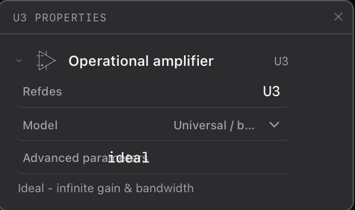
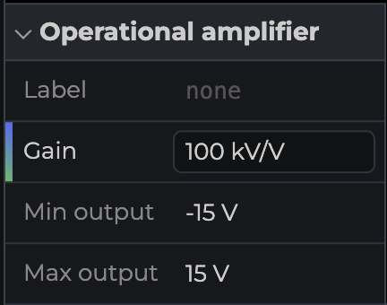

**Problem:** Rows overlap, manual model UI dominates, and useful generic circuit
parameters are absent.

**Required behavior:** `COMP-13A` defines validated generic gain and min/max
output defaults consistent with Tau's generic op-amp model. `COMP-13B` presents
them in the shared inspector rows. Exact imported op-amps retain exact models;
Tau must not pretend the generic controls describe a vendor macro-model.

**Acceptance/tests:** Generic op-amp deck and clipping behavior, invalid
min/max order, named/imported models, save/reopen, both themes, and narrow width.

**Evidence:** `COMP-13A` validated generic gain/min/max definitions and
exact-model-safe encoding landed in `d6fbcfd` from worker `ec86d30`; `COMP-13B`
shared inspector presentation landed in `02371ec` from worker `3b8e97c`.
Electrical focused coverage passed **12 files / 723 tests**, inspector focused
coverage passed **3 files / 114 tests**, and typecheck/design drift passed.
Generic clipping, invalid rail order, named/imported models, narrow-width, and
packaged visual and clipping evidence is complete; see `screenshots/ui-ux-fixes/QA-EVIDENCE.md` (COMP-13).

### [x] COMP-14 - Remove long component-property essays

**Status:** FIXED · corrected by the 2026-08-12 review follow-up above
**Priority:** P2  
**Source:** edits-to-fix, page 6, item 14  

**Problem:** Paragraph-length explanations overwhelm routine properties.

**Required behavior:** Remove prose from all inspectors. Preserve only concise
field help, actionable validation, tooltips, and accessibility descriptions.
Unsupported or refusal diagnostics remain explicit and are not hidden.

**Acceptance/tests:** Automated inspector audit for long description blocks;
contextual help and all failure diagnostics remain reachable.

**Evidence:** concise field-help/tooltip presentation and long-description
removal landed in `02371ec` from worker `3b8e97c`; focused inspector coverage
passed **3 files / 114 tests**, including the long-help audit, typecheck passed,
and design drift passed (**9 checks + 48 tests**). Unsupported/refusal
diagnostics remain explicit in the implementation; packaged contextual-help and
both-theme screenshots are complete; see `screenshots/ui-ux-fixes/QA-EVIDENCE.md` (COMP-14).

### [x] COMP-15 - Make dense digital symbols legible

**Status:** FIXED · corrected by the 2026-08-12 review follow-up above
**Priority:** P1  
**Source:** edits-to-fix, pages 6-7, item 15  
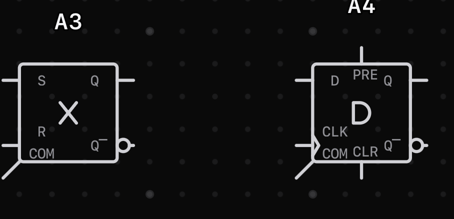

**Problem:** Latch/flip-flop pin labels such as COM, CLR, PRE, and CLK crowd or
overlap the body and each other.

**Required behavior:** Audit all high-pin-count symbols; reposition labels,
use conventional names, and add tooltips/accessible full names where an
abbreviation is necessary. Electrical pin identities and imported pin mapping
must not change.

**Acceptance/tests:** Every rotation/mirror, all latch/flip-flop kinds,
pin-connection tests, imported mapping, collision geometry, and both themes.

**Evidence:** dense digital-symbol geometry remediation landed in `71ad682`
from worker `2d80d0f`; symbol/catalog contract coverage was included in **5
files / 215 passed**, with integrated frontend **256 files / 2 skipped, 4,268
tests / 8 skipped** and typecheck **exit 0**. Rotation/mirror, pin-mapping,
collision and both-theme packaged screenshots are complete; see `screenshots/ui-ux-fixes/QA-EVIDENCE.md` (COMP-15).

### [x] COMP-16 - Simulate a real seven-segment display

**Status:** FIXED
**Priority:** P1 simulation  
**Source:** edits-to-fix, page 7, item 16 (source calls it an 8-bit segment)

**Problem:** The seven-segment component does not visibly show active segments
or the represented digit in Simulator.

**Required behavior:** Derive each segment's active state from the actual
simulation nodes. Illuminate active segments with a semantic design token that
reads as physical red in both themes. Show the corresponding digit for valid
0-9 patterns; for non-digit patterns, show the driven segments without inventing
a number. Do not store derived display state in the schematic.

**Acceptance/tests:** Digits 0-9, blank, invalid/multiple patterns, common
anode/cathode semantics supported by the component, stopped/no-result state,
live updates, both themes, and no hardcoded color outside token policy.

**Evidence:** simulator reflection implementation landed in `10b043e` from
worker `272dfc8`. The focused simulator/operating-point suite passed **3 files
/ 92 tests**, typecheck passed, design drift passed (**9 checks + 47 tests**),
and simulation-sensitive native gates passed (**cargo fmt/clippy exit 0; Rust
104 passed / 42 ignored; real-ngspice ignored 42 passed / 0 failed**). The
implementation derives segment state from solved OP/transient nodes, supports
common-anode/cathode polarity, no-result and non-digit patterns, and keeps
derived state out of the schematic. Packaged light/dark digit 0-9, live-update,
and stopped-state screenshots/native evidence are complete; see `screenshots/ui-ux-fixes/QA-EVIDENCE.md` (COMP-16).

### [x] COMP-17 - Remove the unnecessary switch rectangle

**Status:** FIXED
**Priority:** P2  
**Source:** edits-to-fix, page 7, item 17  
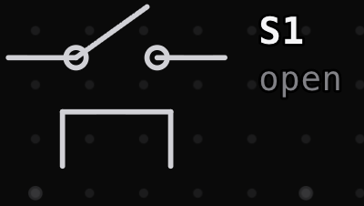

**Problem:** An open rectangle below the switch appears visually unrelated.

**Required behavior:** Trace whether it represents an actuator/control port. If
decorative or redundant, remove it and tighten bounds. If electrically
meaningful, redesign it into an unambiguous standard control indication rather
than deleting a pin or capability.

**Acceptance/tests:** Static and controlled switches, open/closed simulator
states, pin/hit bounds, rotation/mirror, imported mappings, and both themes.

**Evidence:** switch geometry cleanup landed in `71ad682` from worker
`2d80d0f`; geometry/symbol contract coverage was included in **5 files / 215
passed**, with integrated frontend **256 files / 2 skipped, 4,268 tests / 8
skipped** and typecheck **exit 0**. Packaged visual, bounds, and electrical
control-port QA is complete; see `screenshots/ui-ux-fixes/QA-EVIDENCE.md` (COMP-17).

## Completion matrix

- [x] All 24 stable issues are `FIXED_WITH_CURRENT_EVIDENCE`. Nine were
      originally checked against packaged screenshots that showed the defect
      still present; the 2026-08-12 follow-up above fixes them and re-proves
      each one in both `dev:web` and the rebuilt packaged app.
- [x] No issue remains `UNVERIFIED`, `IN PROGRESS`, or `BLOCKED` in the current
      tracker manifest.
- [x] Every issue has a landing reference, literal test result, and a current
      packaged artifact or a current packaged shell/state artifact.
- [x] The native matrix validator proves 30/30 light/dark × 900×600, 1280×800,
      1440×900 × empty/populated/selected/properties/simulator keys.
- [x] Computer Use proves packaged native interactions, current-source/LED
      inspector states, and direct titlebar bounds change/restore.
- [x] Chrome proves responsive `dev:web` behavior with no page-origin console
      errors; extension transport noise is recorded separately.
- [x] Typecheck, frontend tests, design drift, minimum-window, production build,
      applicable Rust/native gates, and packaged-ngspice smoke pass.
- [x] Exact model/import behavior and named-device fail-closed guarantees remain.
- [ ] Final Sol High review has no unresolved actionable findings. **PENDING —
      parent must send the current tip to a fresh Sol High reviewer.**
- [x] `auto/ltspice-parity` is clean and pushed; no fleet worktrees or branches
      remain; nothing is merged to `main`.
